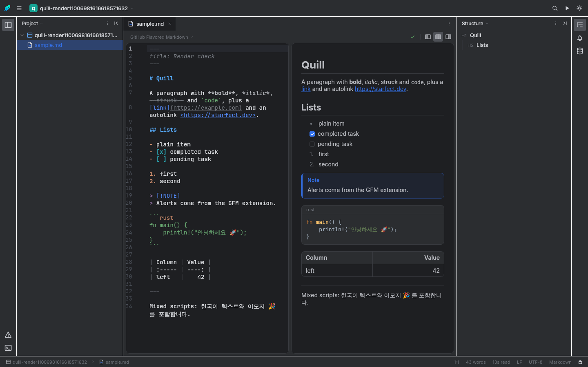
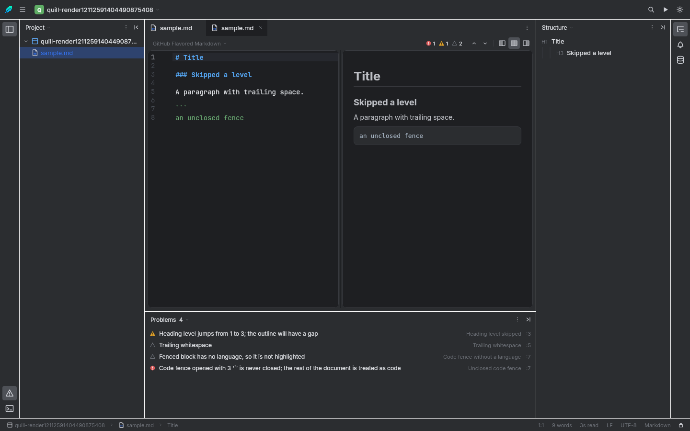
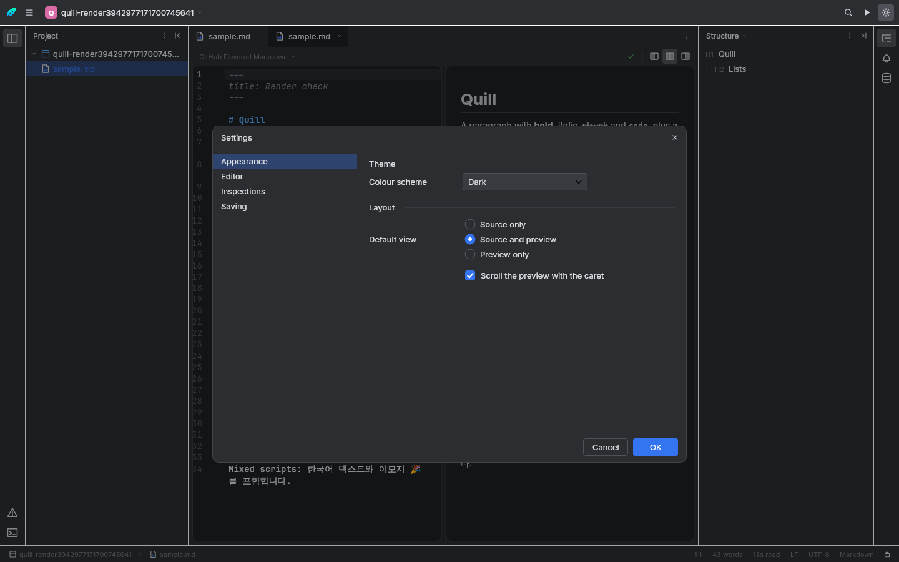

<div align="center">


# Quill

**A Markdown IDE with a Rust engine.**

[](https://github.com/neramc/quill/actions/workflows/ci.yml)
[](LICENSE)
[](https://kotlinlang.org)
[](https://www.rust-lang.org)

</div>

---

Quill treats a Markdown document the way a development environment treats source code. It parses as
you type, tells you what is wrong with what you wrote, shows you the page your document becomes, and
keeps every one of those answers on a background thread so the caret never waits.

The pipeline is written in Rust and reached from Kotlin through the Foreign Function &amp; Memory API.
Nothing on screen is computed twice: the syntax colours in the editor, the outline, the statistics,
the problems list and the rendered page all come from the same engine, from the same parse.

<div align="center">

</div>

## What it does

### Writing

- **Two panes, one document.** The source you are writing and the page it becomes, side by side —
  or either one alone. `Ctrl+1` / `Ctrl+2` / `Ctrl+3`.
- **Syntax highlighting as you type.** A line-oriented lexer, not a structural parse. An editor has
  to colour half-typed markup, and a parser that insists on well-formed input disagrees with what is
  on screen for as long as you are mid-word.
- **Rendered through HTML.** The engine converts the document to HTML and draws that. It is why raw
  HTML in your source renders as markup instead of appearing as literal text, and why the preview
  and the exported file are the same document rather than two renderers with two sets of quirks.
- **Find and replace,** docked above the document, with literal, whole-word and regular-expression
  modes and a match counter in the field. Stepping and replace-all run in the engine.
- **Search Everywhere** (`Ctrl+Shift+P`) over every command, with subsequence matching.

### Dialects

A project rarely holds one kind of Markdown. Quill decides the dialect per document, from the file
extension, and lets you override it from the picker above the editor.

| Dialect | Files | What changes |
|---|---|---|
| **CommonMark** | `.commonmark`, `.cmark` | The specification, with no extensions. |
| **GitHub Flavored Markdown** | `.md`, `.markdown` | Tables, task lists, strikethrough, autolinks, footnotes and alerts. |
| **MDX** | `.mdx` | `import`/`export` statements and `{/* … */}` expressions are stripped before parsing; JSX components survive into the page as elements. Raw HTML passes through. |
| **Markdoc** | `.mdoc`, `.markdoc` | `` … `` becomes an element carrying `data-markdoc`, which the preview draws as a titled callout. |

### Inspections

Fourteen inspections run on every keystroke, reported by the widget above the editor and listed in
the Problems tool window. Clicking a row selects the offending range; `F2` and `Shift+F2` step
through them.

<div align="center">

</div>

They are the mistakes that survive proofreading — a link whose destination is empty still renders as
a link, a heading that jumps from `#` to `###` still renders as a heading, and a footnote defined but
never referenced simply vanishes from the output:

| Severity | Inspections |
|---|---|
| **Error** — will not render as intended | Unclosed code fence · Undefined footnote · Undefined link reference |
| **Warning** — renders, but reads wrong | Heading level skipped · Duplicate heading · More than one title · Link or image with no destination · Image with no alternative text · Unused footnote · Table row with the wrong cell count |
| **Weak** — style notes | Code fence without a language · Hard tab used for indentation · Trailing whitespace · Bare URL |

Three of them cannot be done on the parse tree at all. The parser normalises a ragged table row
before anyone can see it, drops an unreferenced footnote definition entirely, and an unclosed fence
is precisely the case where the parse disagrees with what you are looking at. Those run on source
lines instead.

### Workspace

<table>
<tr>
<td width="50%"></td>
<td width="50%"></td>
</tr>
</table>

- **Tool windows** on three docks: Project, Structure, Problems, Notifications, Terminal, Database.
- **Run configurations** for the document tasks — export to HTML, inspect, count — with their own
  dialog and `Shift+F10`.
- **Settings** covering appearance, editor behaviour, inspections and save actions.
- **Breadcrumbs** along the status bar: project, folders, file, and the heading the caret sits under.
- **Dark and light themes,** switched at runtime.
- **HTML export,** standalone and themed.

## Architecture

```
┌──────────────────── quill-app ─────────────────────────────────────┐
│ Compose Multiplatform + Jewel                                       │
│ toolbar · stripes · tool windows · tabs · dialogs · split panes      │
│ SourceEditor (VisualTransformation) │ PreviewPane (HTML renderer)    │
└────────────────────────────┬────────────────────────────────────────┘
                             │ Kotlin API, suspending, Dispatchers.Default
┌──────────────────── quill-bridge ───────────────────────────────────┐
│ Kotlin facades (AutoCloseable + Cleaner, QWIRE decoding)             │
│ Java downcall layer — MethodHandle.invokeExact                       │
└────────────────────────────┬────────────────────────────────────────┘
                             │ java.lang.foreign downcalls, C ABI
┌──────────────────── quill-core (Rust cdylib) ───────────────────────┐
│ ffi │ document (rope) │ flavour │ parser → IR │ html │ inspect       │
│     │ highlight │ outline │ search │ stats │ export                  │
└─────────────────────────────────────────────────────────────────────┘

  app image ──▶ installer-windows (C# / Avalonia UI 12)
                QuillSetup.exe · QuillUninstall.exe
```

Four decisions shape everything else.

**Rust owns the pipeline.** Parsing, highlighting, inspections, search, outline, statistics, HTML
rendering and export all happen in Rust. Kotlin's text field holds the editable text and forwards
edit deltas into a `ropey` rope; everything else on screen is derived from the engine, version-stamped
so a slow parse can never overwrite a newer one.

**Every offset crossing the boundary is a UTF-16 code unit.** That is the JVM's convention and
Compose's. Converting at the boundary is what keeps a Korean syllable (three UTF-8 bytes, one UTF-16
unit) or an emoji (two units) from displacing every span after it.

**One binary wire format, no JSON.** QWIRE is little-endian, length-prefixed and depth-first. It
keeps a serialization framework and its reflection out of the dependency graph, and every read is
bounds-checked, so a corrupt payload throws instead of over-reading native memory.

**The downcall layer is Java, not Kotlin.** `MethodHandle.invokeExact` is signature-polymorphic:
the compiler takes the descriptor from the call site. Kotlin compiles it as an ordinary varargs call
and it fails at run time with a `WrongMethodTypeException`. In Java a descriptor mismatch is a
compile error instead.

Details in [`docs/ARCHITECTURE.md`](docs/ARCHITECTURE.md) and [`docs/FFI.md`](docs/FFI.md).

## Building

You need a Rust toolchain. The JDK is provisioned automatically by the Gradle toolchain resolver —
Quill draws its own window decoration, which needs the JBR build of the JDK, and the version catalog
asks for it by vendor.

```bash
./gradlew build                              # engine, bridge, UI, every test
./gradlew :quill-app:run                     # run it
./gradlew :quill-app:createDistributable     # jlink app image
./gradlew :quill-app:packageReleaseDeb       # ProGuard + jlink + .deb
```

The Windows installer is a separate .NET 10 solution:

```bash
cd installer-windows && dotnet test          # engine and headless UI tests
tools/build-installer.sh --app-image <dir>   # QuillSetup.exe + QuillUninstall.exe
```

See [`docs/BUILD.md`](docs/BUILD.md) and [`docs/INSTALLER.md`](docs/INSTALLER.md).

## Testing

```bash
cargo test --manifest-path quill-core/Cargo.toml   # the engine, on its own
./gradlew :quill-bridge:test                       # the ABI, against the real cdylib
./gradlew :quill-app:test                          # the UI, composed offscreen
dotnet test installer-windows/Quill.Setup.sln      # the installer engine and wizard
```

The bridge suite is the one that proves the ABI: it drives the real shared library through the FFM
API and checks the offset convention, the wire format and buffer ownership across the boundary. The
UI suite composes the whole shell into a Skia raster surface with no display server, writing every
frame to `quill-app/build/test-renders/` — the screenshots in this README are those files.

## Repository layout

| Path | What is in it |
|---|---|
| `quill-core/` | The Rust `cdylib`: FFI surface, rope document, dialects, parser, HTML, inspections, highlighters, search, export. |
| `quill-bridge/` | Java FFM downcalls plus Kotlin facades and the QWIRE decoder. |
| `quill-app/` | The Compose Multiplatform + Jewel application. |
| `installer-windows/` | C# / Avalonia UI 12 installer, uninstaller, setup engine and tests. |
| `buildSrc/` | The Gradle task that builds and stages the Rust library. |
| `tools/` | Packaging scripts. |
| `docs/` | Architecture, FFI contract, build and installer documentation. |

## Contributing

Bug reports, feature requests and pull requests are welcome. Start with
[`CONTRIBUTING.md`](CONTRIBUTING.md) for the development setup and what a reviewable change looks
like, and [`CODE_OF_CONDUCT.md`](CODE_OF_CONDUCT.md) for how we work together. Security issues go
through [`SECURITY.md`](SECURITY.md) rather than the public tracker.

## Licence

GPL-3.0. See [`LICENSE`](LICENSE).
