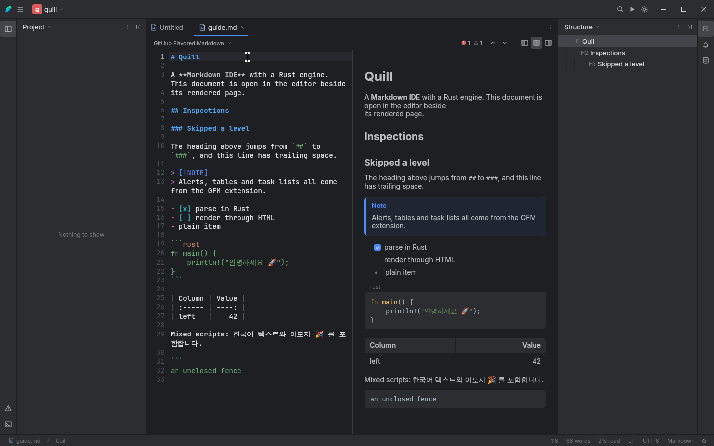
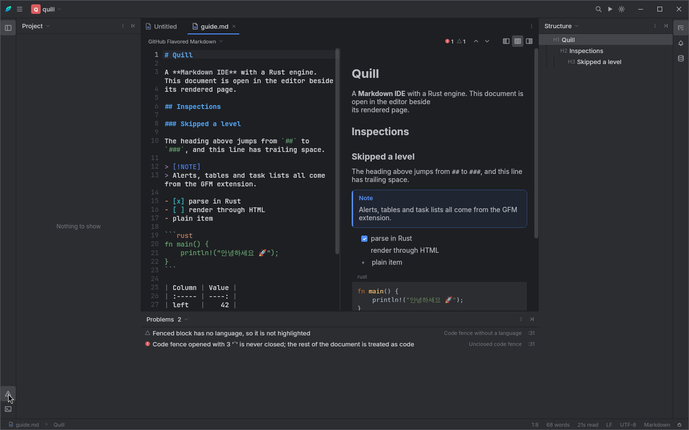
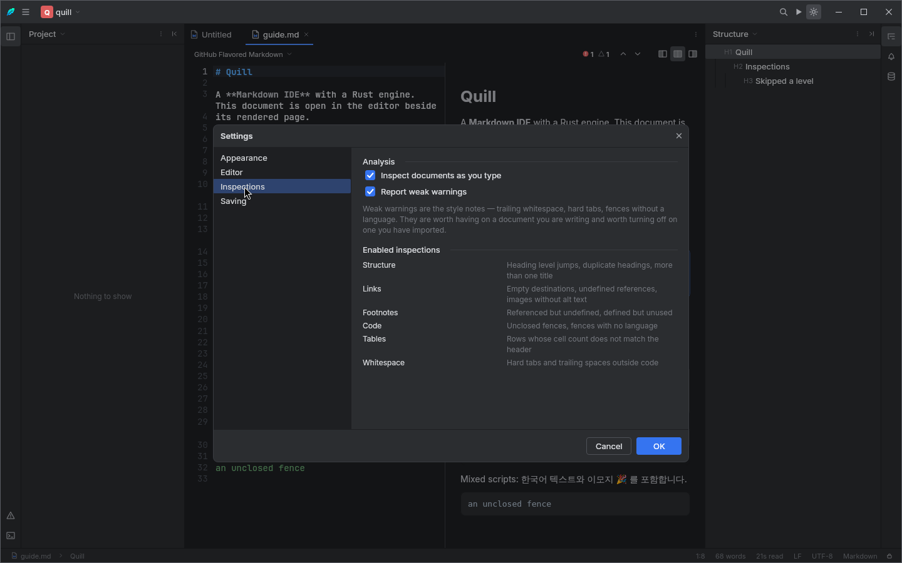
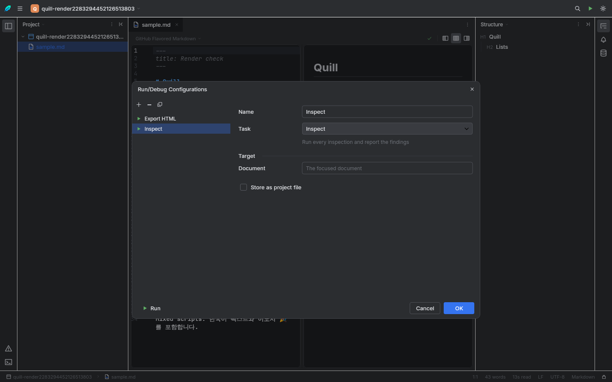

<div align="center">


# Quill

**A Markdown IDE with a Rust engine.**

[](https://github.com/neramc/quill/actions/workflows/ci.yml)
[](LICENSE)
[](https://kotlinlang.org)
[](https://www.rust-lang.org)

</div>

---

Quill treats a Markdown document the way a development environment treats source code. It parses as
you type, tells you what is wrong with what you wrote, shows you the page your document becomes, and
keeps every one of those answers on a background thread so the caret never waits.

The pipeline is written in Rust and reached from Kotlin through the Foreign Function &amp; Memory API.
Nothing on screen is computed twice: the syntax colours in the editor, the outline, the statistics,
the problems list and the rendered page all come from the same engine, from the same parse.

<div align="center">

</div>

## What it does

### Writing

- **Two panes, one document.** The source you are writing and the page it becomes, side by side —
  or either one alone. `Ctrl+1` / `Ctrl+2` / `Ctrl+3`.
- **Syntax highlighting as you type.** A line-oriented lexer, not a structural parse. An editor has
  to colour half-typed markup, and a parser that insists on well-formed input disagrees with what is
  on screen for as long as you are mid-word.
- **Rendered through HTML.** The engine converts the document to HTML and draws that. It is why raw
  HTML in your source renders as markup instead of appearing as literal text, and why the preview
  and the exported file are the same document rather than two renderers with two sets of quirks.
- **Find and replace,** docked above the document, with literal, whole-word and regular-expression
  modes and a match counter in the field. Stepping and replace-all run in the engine.
- **Search Everywhere** (`Ctrl+Shift+P`) over every command, with subsequence matching.
- **Every Markdown feature, searchable** (`Ctrl+K`), or by typing `/` at the start of a line.
  Markdown's problem was never that it is hard — it is that nobody remembers all of it. Each entry
  shows the syntax it writes, so twice through the list and you no longer need it. The `/` trigger
  only fires at the start of a line, because `and/or` and `src/main` are prose.
- **Paste from anywhere.** The clipboard is never one thing: copy a passage from a web page and it
  carries plain text *and* an HTML fragment, and the plain one — the flavour a naive paste takes —
  is the one the structure has already been thrown away from. Quill converts the HTML, so a paste
  from Word, Notion, Google Docs, Confluence or a rendered README arrives as source you would have
  typed. Google Docs' `font-weight:700` bold and Word's `mso-list` paragraphs are both handled.
- **Drop a file or a screenshot** anywhere in the window: an image is filed beside the document and
  linked, a file from elsewhere is copied in first.
- **Tick a checkbox in the preview** and the source changes. A checklist you can read and cannot
  tick is a picture of a checklist.
- **Drag a section in the Structure panel** to move it — the heading and every subsection under it.
- **A table of contents that stays current,** between `<!-- toc -->` and `<!-- /toc -->`. A document
  without the markers is never touched.
- **Vim mode** — a parser, not a key map: `d2w`, `yyp`, `ci"`, counts, operators, motions, registers,
  `u`/`Ctrl+R` and `:w`/`:q`. Insert mode is deliberately left alone, so input methods, dead keys
  and the clipboard keep working.
- **Focus Mode** (`Ctrl+Shift+D`): one centred column, every paragraph but the current one dimmed,
  and nothing else on screen. `Ctrl+Shift+M` switches between writing and reading.

### Dialects

A project rarely holds one kind of Markdown. Quill decides the dialect per document, from the file
extension, and lets you override it from the picker above the editor.

| Dialect | Files | What changes |
|---|---|---|
| **CommonMark** | `.commonmark`, `.cmark` | The specification, with no extensions. |
| **GitHub Flavored Markdown** | `.md`, `.markdown` | Tables, task lists, strikethrough, autolinks, footnotes and alerts. |
| **MDX** | `.mdx` | `import`/`export` statements and `{/* … */}` expressions are stripped before parsing; JSX components survive into the page as elements. Raw HTML passes through. |
| **Markdoc** | `.mdoc`, `.markdoc` | `` … `` becomes an element carrying `data-markdoc`, which the preview draws as a titled callout. |
| **MyST** | `.myst`, `.mystmd` | `$x$` and `$$…$$` maths, `:::{note}` directives, definition lists and `[[wiki links]]`. What Jupyter Book and Sphinx read. |
| **Pandoc Markdown** | `.pandoc`, `.pmd` | The most permissive of the family: definition lists, maths, `H~2~O` and `x^2^`, `==marked==`, inline `^[footnotes]` and `{#custom-id}` headings. |
| **MultiMarkdown** | `.mmd` | Tables, footnotes, definition lists, maths, sub- and superscript — and none of GitHub's additions. |
| **Markdown Extra** | `.mdextra` | The original set: tables, footnotes, definition lists and `{#custom-id}`. A `- [x]` here is a bullet containing brackets, which is what it meant before GitHub gave it another meaning. |

These are parser configurations, not labels. `$x^2$` is a formula in MyST and three characters in
CommonMark; `H~2~O` is a subscript in Pandoc and a pair of tildes in GFM; a definition list parses
in Markdown Extra and a task list does not.

**AsciiDoc and Djot are deliberately absent.** Neither is a Markdown superset — they are separate
grammars with their own block and inline syntax, and supporting them means a second parser rather
than another option set on this one. Listing them with a Markdown parser behind them would show
`= Title` as literal text and call it support.

### Searching a project

`Ctrl+Shift+F` opens one dialog with five scopes, because "where is that" is not one question:

| Scope | The question it answers |
|---|---|
| **Files** (`Ctrl+Shift+N`) | You know roughly what it is called. Subsequence matching over the path, so `docsdep` finds `docs/deployment.md`. |
| **Text** (`Ctrl+Shift+F`) | You know what it says. |
| **Regex** | You know the shape — every link to the old domain, say. |
| **Recent** (`Ctrl+E`) | You only know it was yesterday. |
| **TODO** (`Ctrl+Shift+O`) | The notes you left yourself, which are a list you can never otherwise see because they are scattered through every file that has one. |

Build output and version control are never searched, and a truncated result set says so — the
absence of a result should never read as proof the project has none.

### Exporting

| Format | What it is for |
|---|---|
| **HTML** | A standalone page with the styling baked in. |
| **PDF** | Fixed pages with the font embedded — including a CJK font when the document needs one, so Korean is glyphs rather than empty boxes. |
| **Word** | Headings, lists and tables as real Word *styles*, so the document can be navigated and restyled. |
| **EPUB** | A reflowable book with a table of contents. |
| **Confluence** | Storage format: a code block is a macro, a callout is a macro, a task list is a first-class element. |
| **Notion** | Markdown in the subset Notion imports — three heading levels, no raw HTML — because Markdown it cannot represent imports as literal text in the middle of the page. |
| **GitHub README** | GFM, with other dialects' syntax translated into what GitHub actually renders. |

The last three are translations rather than renderings: the output is still a document, which the
target system then owns. Every lossy step loses the *syntax* and keeps the *content* — a footnote
becomes a numbered note, a definition list becomes a bold term and its definition, neither becomes
nothing.

### Inspections

Fourteen inspections run on every keystroke, reported by the widget above the editor and listed in
the Problems tool window. Clicking a row selects the offending range; `F2` and `Shift+F2` step
through them.

<div align="center">

</div>

They are the mistakes that survive proofreading — a link whose destination is empty still renders as
a link, a heading that jumps from `#` to `###` still renders as a heading, and a footnote defined but
never referenced simply vanishes from the output:

| Severity | Inspections |
|---|---|
| **Error** — will not render as intended | Unclosed code fence · Undefined footnote · Undefined link reference |
| **Warning** — renders, but reads wrong | Heading level skipped · Duplicate heading · More than one title · Link or image with no destination · Image with no alternative text · Unused footnote · Table row with the wrong cell count |
| **Weak** — style notes | Code fence without a language · Hard tab used for indentation · Trailing whitespace · Bare URL |

Three of them cannot be done on the parse tree at all. The parser normalises a ragged table row
before anyone can see it, drops an unreferenced footnote definition entirely, and an unclosed fence
is precisely the case where the parse disagrees with what you are looking at. Those run on source
lines instead.

### Workspace

<table>
<tr>
<td width="50%"></td>
<td width="50%"></td>
</tr>
</table>

- **Tool windows** on three docks: Project, Structure, Problems, Notifications, Terminal, Database.
- **Run configurations** for the document tasks — export to HTML, inspect, count — with their own
  dialog and `Shift+F10`.
- **Settings** covering appearance, editor behaviour, inspections and save actions.
- **Breadcrumbs** along the status bar: project, folders, file, and the heading the caret sits under.
- **Dark and light themes,** switched at runtime.
- **Export** to HTML, PDF, Word, EPUB, Confluence, Notion and a GitHub README.

## Architecture

```
┌──────────────────── quill-app ─────────────────────────────────────┐
│ Compose Multiplatform + Jewel                                       │
│ toolbar · stripes · tool windows · tabs · dialogs · split panes      │
│ SourceEditor (VisualTransformation) │ PreviewPane (HTML renderer)    │
└────────────────────────────┬────────────────────────────────────────┘
                             │ Kotlin API, suspending, Dispatchers.Default
┌──────────────────── quill-bridge ───────────────────────────────────┐
│ Kotlin facades (AutoCloseable + Cleaner, QWIRE decoding)             │
│ Java downcall layer — MethodHandle.invokeExact                       │
└────────────────────────────┬────────────────────────────────────────┘
                             │ java.lang.foreign downcalls, C ABI
┌──────────────────── quill-core (Rust cdylib) ───────────────────────┐
│ ffi │ document (rope) │ flavour │ parser → IR │ html │ inspect       │
│     │ highlight │ outline │ search │ stats │ export                  │
└─────────────────────────────────────────────────────────────────────┘

  app image ──▶ installer-windows (C# / Avalonia UI 12)
                QuillSetup.exe · QuillUninstall.exe
```

Four decisions shape everything else.

**Rust owns the pipeline.** Parsing, highlighting, inspections, search, outline, statistics, HTML
rendering and export all happen in Rust. Kotlin's text field holds the editable text and forwards
edit deltas into a `ropey` rope; everything else on screen is derived from the engine, version-stamped
so a slow parse can never overwrite a newer one.

**Every offset crossing the boundary is a UTF-16 code unit.** That is the JVM's convention and
Compose's. Converting at the boundary is what keeps a Korean syllable (three UTF-8 bytes, one UTF-16
unit) or an emoji (two units) from displacing every span after it.

**One binary wire format, no JSON.** QWIRE is little-endian, length-prefixed and depth-first. It
keeps a serialization framework and its reflection out of the dependency graph, and every read is
bounds-checked, so a corrupt payload throws instead of over-reading native memory.

**The downcall layer is Java, not Kotlin.** `MethodHandle.invokeExact` is signature-polymorphic:
the compiler takes the descriptor from the call site. Kotlin compiles it as an ordinary varargs call
and it fails at run time with a `WrongMethodTypeException`. In Java a descriptor mismatch is a
compile error instead.

Details in [`docs/ARCHITECTURE.md`](docs/ARCHITECTURE.md) and [`docs/FFI.md`](docs/FFI.md).

## Installing

Every release carries a native package and a portable archive for each platform, plus a
`SHA256SUMS` file. Take the latest from the
[releases page](https://github.com/neramc/quill/releases).

| Platform | Install | Portable |
|---|---|---|
| Linux x64 | `.deb` · `.rpm` | `Quill-<version>-linux-x64.tar.gz` |
| Linux arm64 | `.deb` · `.rpm` | `Quill-<version>-linux-arm64.tar.gz` |
| macOS Apple Silicon | `.dmg` | `Quill-<version>-macos-arm64.tar.gz` |
| macOS Intel | `.dmg` | `Quill-<version>-macos-x64.tar.gz` |
| Windows x64 | `QuillSetup-<version>-windows-x64.exe` | `Quill-<version>-windows-x64.zip` |

The portable archives carry their own Java runtime and the Rust engine — unpack anywhere and run
`bin/Quill`. Nothing is written outside the folder, so uninstalling is deleting it. They exist
because every native package assumes something the portable one does not: a package manager, an
administrator, a writable `/opt`.

**Windows on ARM** runs the x64 build under emulation. There is no separate arm64 Windows package,
because it would be a download nobody needs to choose between.

**macOS, first launch.** These builds are not signed with an Apple Developer certificate, so
Gatekeeper refuses the first launch with "Quill is damaged and can't be opened". The message is
about the missing signature, not the download. Clear the quarantine flag:

```sh
xattr -dr com.apple.quarantine /Applications/Quill.app
```

**Verifying a download:**

```sh
sha256sum --check --ignore-missing SHA256SUMS
```

## Building

You need a Rust toolchain. The JDK is provisioned automatically by the Gradle toolchain resolver —
Quill draws its own window decoration, which needs the JBR build of the JDK, and the version catalog
asks for it by vendor.

```bash
./gradlew build                              # engine, bridge, UI, every test
./gradlew :quill-app:run                     # run it
./gradlew :quill-app:createDistributable     # jlink app image
./gradlew :quill-app:packageReleaseDeb       # ProGuard + jlink + .deb
./gradlew :quill-app:packagePortable         # the portable .tar.gz / .zip
```

Packaging is per-platform by construction: jpackage builds for the machine it runs on, and the
bundled runtime and Rust library are native. The release workflow therefore runs one job per
platform rather than cross-compiling, which is also what makes each one a real test of that
platform.

The Windows installer is a separate .NET 10 solution:

```bash
cd installer-windows && dotnet test          # engine and headless UI tests
tools/build-installer.sh --app-image <dir>   # QuillSetup.exe + QuillUninstall.exe
```

See [`docs/BUILD.md`](docs/BUILD.md) and [`docs/INSTALLER.md`](docs/INSTALLER.md).

## Testing

```bash
cargo test --manifest-path quill-core/Cargo.toml   # the engine, on its own
./gradlew :quill-bridge:test                       # the ABI, against the real cdylib
./gradlew :quill-app:test                          # the UI, composed offscreen
dotnet test installer-windows/Quill.Setup.sln      # the installer engine and wizard
```

The bridge suite is the one that proves the ABI: it drives the real shared library through the FFM
API and checks the offset convention, the wire format and buffer ownership across the boundary. The
UI suite composes the whole shell into a Skia raster surface with no display server, writing every
frame to `quill-app/build/test-renders/`.

The screenshots in this README are not those frames. They are the packaged release binary — the one
that has been through ProGuard — running on a virtual display and driven by real pointer events, with
the X server's own framebuffer decoded to PNG. That distinction has already earned its keep: a
setting that applied correctly in every offscreen test did nothing when clicked, because the value
reached the state and nothing re-derived from it.

## Repository layout

| Path | What is in it |
|---|---|
| `quill-core/` | The Rust `cdylib`: FFI surface, rope document, dialects, parser, HTML, inspections, highlighters, search, export. |
| `quill-bridge/` | Java FFM downcalls plus Kotlin facades and the QWIRE decoder. |
| `quill-app/` | The Compose Multiplatform + Jewel application. |
| `installer-windows/` | C# / Avalonia UI 12 installer, uninstaller, setup engine and tests. |
| `buildSrc/` | The Gradle task that builds and stages the Rust library. |
| `tools/` | Packaging scripts. |
| `docs/` | Architecture, FFI contract, build and installer documentation. |

## Contributing

Bug reports, feature requests and pull requests are welcome. Start with
[`CONTRIBUTING.md`](CONTRIBUTING.md) for the development setup and what a reviewable change looks
like, and [`CODE_OF_CONDUCT.md`](CODE_OF_CONDUCT.md) for how we work together. Security issues go
through [`SECURITY.md`](SECURITY.md) rather than the public tracker.

## Licence

GPL-3.0. See [`LICENSE`](LICENSE).
