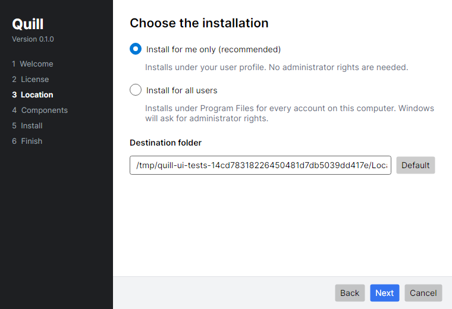
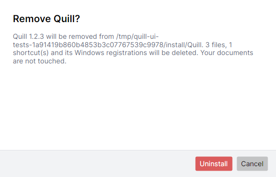

# The Windows installer

Windows setup is a hand-built C# / Avalonia UI 12 application under `installer-windows/`, not a
jpackage MSI. That choice buys control over the wizard, the uninstall behaviour, the registry
footprint and the elevation model — all of which an MSI decides for you.

<div align="center">

</div>

## Solution layout

| Project | Target | What it is |
|---|---|---|
| `Quill.Setup.Core` | `net10.0` + `net10.0-windows` | Install engine, manifest, payload format, platform abstraction. |
| `Quill.Installer` | `net10.0` + `net10.0-windows` | The Avalonia wizard → `QuillSetup.exe`. |
| `Quill.Setup.Pack` | `net10.0` | Build-time tool that packs an app image into a payload archive. |
| `Quill.Setup.Tests` | `net10.0` | xUnit tests for the engine. |
| `Quill.Setup.UiTests` | `net10.0` | Headless Avalonia tests that render the real windows. |

The dual targeting is deliberate. Everything except the Windows integration compiles into plain
`net10.0`, which is what lets the install sequence be tested — and the wizard be developed and
screenshotted — on a machine that is not Windows. The shipped binaries are always
published from `net10.0-windows`.

## Installing is recorded, not inferred

Every file, directory, shortcut, file association and PATH entry the installer creates is written
into `install-manifest.json` in the install root. Uninstalling replays that list in reverse.

This is the central design decision, and it has consequences that matter:

- The uninstaller never guesses which files belong to Quill. A user who installed into a folder
  they also keep notes in keeps the notes: directories are removed only when empty, never
  recursively.
- A manifest entry that resolves outside the install root is refused rather than followed, so a
  tampered manifest cannot turn the uninstaller into a delete-anything tool.
- A manifest written by a newer installer is refused with an explanation rather than
  half-understood.
- A missing manifest is an explicit failure. The uninstaller says so and stops.

## The payload

The application image is packed into a zip that carries a SHA-256 index of its own contents, and
`QuillSetup.exe` embeds that zip as a resource — so setup runs offline with nothing beside it.

Extraction verifies each file's hash **after** it lands on disk, not before. That covers the disk as
well as the archive: a failing drive that drops a sector fails the installation instead of producing
an installation that crashes at first launch. Entry paths are resolved against the install root and
rejected if they escape it.

The packer and the extractor are the same code (`PayloadBuilder` / `PayloadExtractor`), so the
archive and its index cannot disagree about format. A zip produced by any other tool is rejected.

## Scope and elevation

| | Per-user (default) | All-users |
|---|---|---|
| Location | `%LOCALAPPDATA%\Programs\Quill` | `%ProgramFiles%\Quill` |
| Registry | `HKCU` | `HKLM` |
| Shortcuts | User Start menu / desktop | Common Start menu / desktop |
| Elevation | None | Required |

`app.manifest` requests `asInvoker`, not `requireAdministrator`. An editor is a per-user tool, and a
wizard that opens with a UAC prompt is a wizard many people cancel. Choosing "all users" relaunches
the process elevated with the answers already given, so the user fills the wizard in once and sees
one prompt.

## What gets registered

- **Uninstall entry** under `…\CurrentVersion\Uninstall\Quill`, with `UninstallString`,
  `QuietUninstallString` (`… /S`), `DisplayIcon`, `EstimatedSize` and `HelpLink`.
- **Shortcuts** as real `.lnk` files written through `IShellLink`. Windows has no managed shortcut
  API; driving `WScript.Shell` through late-bound COM breaks under single-file publishing, and
  hand-writing the `.lnk` binary format means reimplementing a shell format for no benefit.
- **File associations** for `.md` and `.markdown` via a `Quill.Markdown` ProgId. The previous
  handler is saved, and restored on uninstall — but only if the extension is still ours. If another
  editor has claimed it since installation, uninstalling leaves it alone.
- **PATH**, optionally. The registry value is read with `DoNotExpandEnvironmentNames`, because
  reading PATH through `Environment.GetEnvironmentVariable` expands embedded `%VAR%` references and
  writing the expanded result back permanently flattens the user's PATH.

## Ordering

Install: files → manifest → shortcuts, associations, PATH → uninstall entry. If the process dies
partway, what exists on disk is a prefix of a valid installation rather than a shortcut aiming at
nothing, and everything that did complete is already recorded.

### Uninstall is not part of this solution

There is no uninstaller executable. Quill removes itself: the registered `UninstallString` is
`"<root>\bin\Quill.exe" --uninstall`, and the removal lives in the application, in
`dev.starfect.quill.install.Uninstall`.

This deleted a hundred and three megabytes — a self-contained .NET application whose only job was to
delete files, shipped in every release and then left in the install folder forever, larger than the
editor it removed. It also removed a whole class of failure: the remover can no longer be missing,
be the wrong version, or disagree with what it is removing, because it *is* what it is removing.

The order is the install order backwards — uninstall entry → associations → PATH → shortcuts →
files → directories, deepest first — but it happens in two halves, because Windows will not unlink a
running executable or a loaded DLL and an installed Quill is a JVM, a Skia library and forty
megabytes of open class files. The registrations and shortcuts go immediately; the files are handed
to a script in `%TEMP%` that waits for Quill's process to exit and then removes them. Directories go
with plain `rd`, never `rd /s`, so a user who installed into a folder holding their own files keeps
those files.

## Command line

`QuillSetup.exe` and `Quill.exe --uninstall` both accept `/S` for a silent run, which is the
convention Apps & features invokes.

```
QuillSetup.exe /S                                  # per-user, default components
QuillSetup.exe /S --all-users --target "C:\Apps\Quill"
QuillSetup.exe /S --start-menu --associate         # only these components
Quill.exe --uninstall /S
```

Passing no component switch means "use the defaults"; passing any means the absent ones are off.
That distinction is what lets the elevated relaunch carry exactly the user's choices.

## Building

```bash
cd installer-windows
dotnet test                                        # engine + headless UI tests

tools/build-installer.sh --app-image <windows-app-image>
tools/build-installer.sh --no-payload              # UI work without a Gradle build
```

The script publishes the uninstaller, stages it into a copy of the app image, packs the payload,
then publishes the installer with that payload embedded. The uninstaller ships *inside* the payload
so an installation carries its own remover.

Publishing is `-r win-x64 --self-contained -p:PublishSingleFile=true` and cross-compiles from Linux
or macOS. NativeAOT is not used — it cannot cross-compile to Windows — and trimming is off because
Avalonia's XAML loader and the COM interop both resolve types at runtime.

The application image itself must come from a Windows machine; jpackage cannot cross-build one. CI
hands the Windows job's app image to the .NET job.

## Testing

`dotnet test` runs both suites:

- **Engine tests** drive real installs and uninstalls in a temporary directory against
  `DryRunPlatformIntegration`, which models registry, shortcut, association and PATH state rather
  than merely logging calls — so a test can assert that uninstalling leaves nothing behind.
- **Headless UI tests** render the shipped windows through Avalonia's Skia headless platform, check
  that every page draws and that no two pages render identically, and write PNGs for inspection.
  They construct the real `MainWindow` with the real view models and merge both executables'
  palettes, so a renamed brush or a broken binding fails the test.

<div align="center">

</div>

## What cannot be verified off Windows

The `win-x64` binaries are *built* on Linux but cannot be *run* there. Registry writes, `IShellLink`
shortcut creation, file association registration, PATH updates, UAC elevation and the post-exit
self-delete are all exercised only through `DryRunPlatformIntegration`. Their real behaviour needs a
Windows machine.
